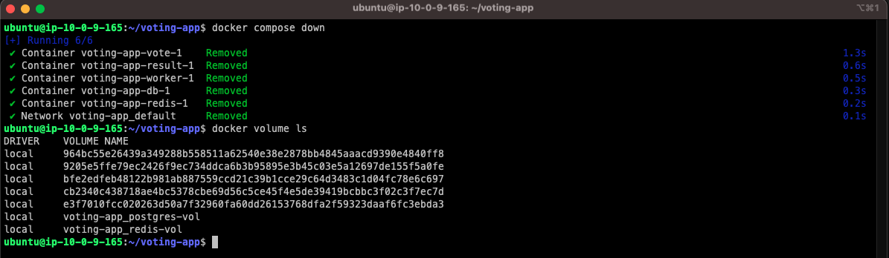
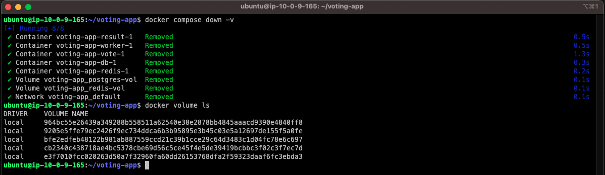
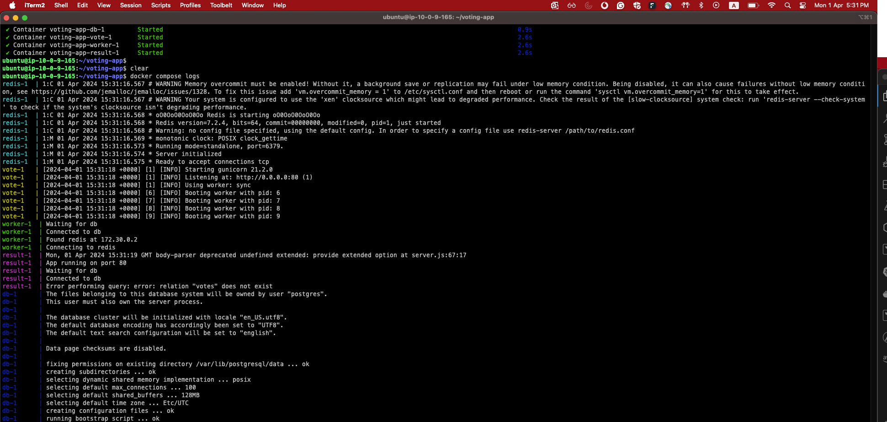
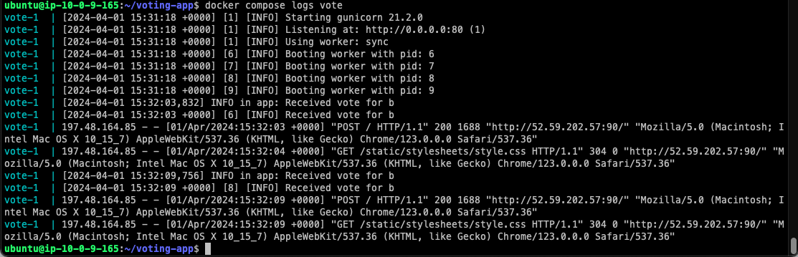

# voting-app-docker-compose
> [!NOTE]
> The code of the three applications (vote, worker, and result) are taken from [example-voting-app](https://github.com/dockersamples/example-voting-app). I only developed the docker-compose file to get hands-on experience


## Prerequisites
1. Docker and docker compose installed on the host
```shell
docker compose version
```
The output should be something like:
> Docker Compose version vX.XX.X

2. Clone this GitHub Repo
```shell
git clone https://github.com/anas1243/voting-app-docker-compose.git voting-app
```

## Manual
1. run the stack in the background
```shell
docker compose up -d
```


2. put your vote in the voting app on port 90


3. Get the result form the result app on port 91


## learned topics

1. Network

Docker creates a new bridge network specifically for the stack with DNS enabled that's why applications can reach each others using their containers name

2. Volumes

Docker don't delete the volumes in the stack when you delete the stack
```shell
docker compose down
```


unless you get it -v option

```shell
docker compose down -v
```


3. logs 

- you can always see all stack logs

```shell
docker compose logs
```



- you can always see specific app logs

```shell
docker compose logs vote
```




